

    <table class="gallery-table">
      <thead>
        <tr>
          <th style="width: 50%;">Stimulus</th>
          <th style="width: 50%;">Ours</th>
        </tr>
      </thead>
      <tbody>
        <tr>
          <td>
            

              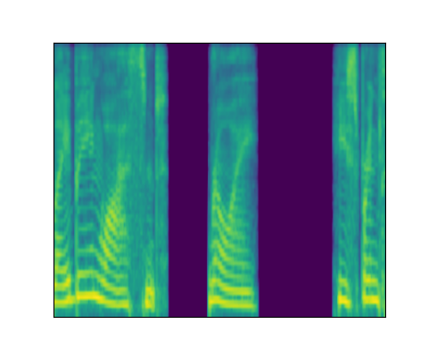
              <audio controls>
                <source src="assets/recon/gt/ses_0_cable_spool_fort_4_005.wav" type="audio/mp3">
                Your browser does not support the audio element.
              </audio>
            

          </td>
          <td>
            

              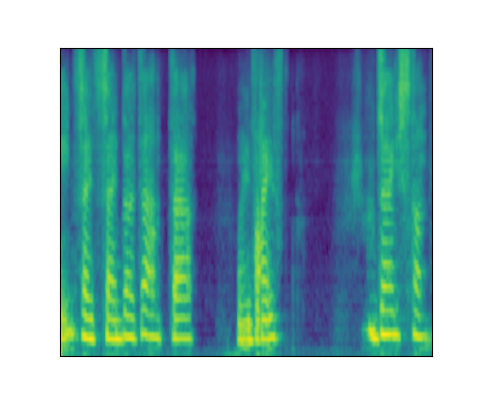
              <audio controls>
                <source src="assets/recon/ours/ses_0_cable_spool_fort_4_005.wav" type="audio/mp3">
                Your browser does not support the audio element.
              </audio>
            

          </td>
        </tr>
      </tbody>
    </table>

<table class="gallery-table">
  <thead>
    <tr>
      <th>Mel</th>
      <th>Wav2vec2</th>
      <th>AudioMAE</th>
      <th>EnCodec</th>
    </tr>
  </thead>
  <tbody>
    <tr>
      <td>
        

          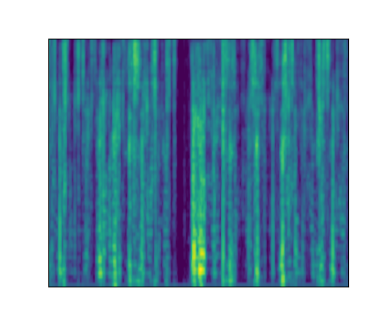
          <audio controls>
            <source src="assets/recon/mel/ses_0_cable_spool_fort_4_005.wav" type="audio/mp3">
            Your browser does not support the audio element.
          </audio>
        

      </td>
      <td>
        

          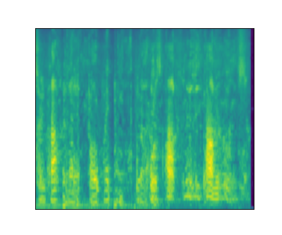
          <audio controls>
            <source src="assets/recon/wav2vec2/ses_0_cable_spool_fort_4_005.wav" type="audio/mp3">
            Your browser does not support the audio element.
          </audio>
        

      </td>
      <td>
        

          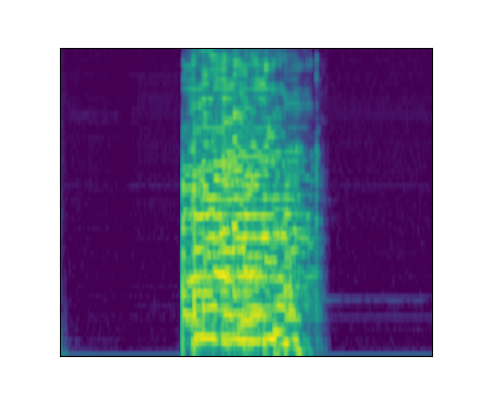
          <audio controls>
            <source src="assets/recon/audiomae/ses_0_cable_spool_fort_4_005.wav" type="audio/mp3">
            Your browser does not support the audio element.
          </audio>
        

      </td>
      <td>
        

          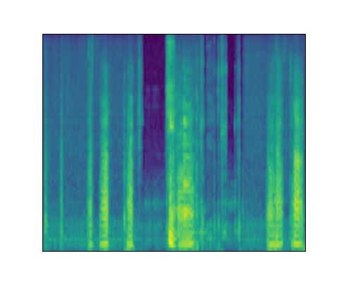
          <audio controls>
            <source src="assets/recon/encodec/ses_0_cable_spool_fort_4_005.wav" type="audio/mp3">
            Your browser does not support the audio element.
          </audio>
        

      </td>
    </tr>
  </tbody>
</table>

---

    <table class="gallery-table">
      <thead>
        <tr>
          <th style="width: 50%;">Stimulus</th>
          <th style="width: 50%;">Ours</th>
        </tr>
      </thead>
      <tbody>
        <tr>
          <td>
            

              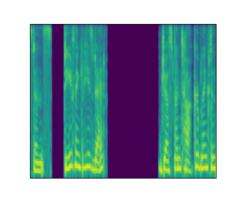
              <audio controls>
                <source src="assets/recon/gt/ses_0_cable_spool_fort_5_021.wav" type="audio/mp3">
                Your browser does not support the audio element.
              </audio>
            

          </td>
          <td>
            

              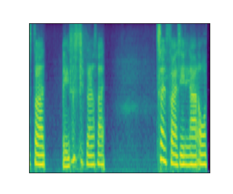
              <audio controls>
                <source src="assets/recon/ours/ses_0_cable_spool_fort_5_021.wav" type="audio/mp3">
                Your browser does not support the audio element.
              </audio>
            

          </td>
        </tr>
      </tbody>
    </table>

<table class="gallery-table">
  <thead>
    <tr>
      <th>Mel</th>
      <th>Wav2vec2</th>
      <th>AudioMAE</th>
      <th>EnCodec</th>
    </tr>
  </thead>
  <tbody>
    <tr>
      <td>
        

          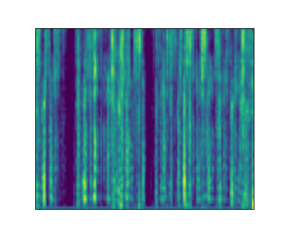
          <audio controls>
            <source src="assets/recon/mel/ses_0_cable_spool_fort_5_021.wav" type="audio/mp3">
            Your browser does not support the audio element.
          </audio>
        

      </td>
      <td>
        

          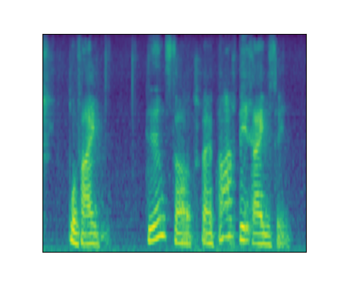
          <audio controls>
            <source src="assets/recon/wav2vec2/ses_0_cable_spool_fort_5_021.wav" type="audio/mp3">
            Your browser does not support the audio element.
          </audio>
        

      </td>
      <td>
        

          
          <audio controls>
            <source src="assets/recon/audiomae/ses_0_cable_spool_fort_5_021.wav" type="audio/mp3">
            Your browser does not support the audio element.
          </audio>
        

      </td>
      <td>
        

          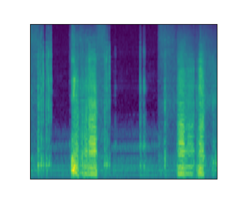
          <audio controls>
            <source src="assets/recon/encodec/ses_0_cable_spool_fort_5_021.wav" type="audio/mp3">
            Your browser does not support the audio element.
          </audio>
        

      </td>
    </tr>
  </tbody>
</table>

---

    <table class="gallery-table">
      <thead>
        <tr>
          <th style="width: 50%;">Stimulus</th>
          <th style="width: 50%;">Ours</th>
        </tr>
      </thead>
      <tbody>
        <tr>
          <td>
            

              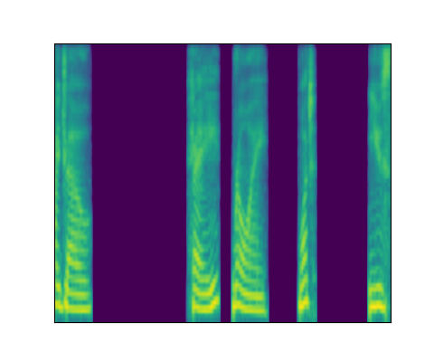
              <audio controls>
                <source src="assets/recon/gt/ses_0_cable_spool_fort_5_043.wav" type="audio/mp3">
                Your browser does not support the audio element.
              </audio>
            

          </td>
          <td>
            

              
              <audio controls>
                <source src="assets/recon/ours/ses_0_cable_spool_fort_5_043.wav" type="audio/mp3">
                Your browser does not support the audio element.
              </audio>
            

          </td>
        </tr>
      </tbody>
    </table>

<table class="gallery-table">
  <thead>
    <tr>
      <th>Mel</th>
      <th>Wav2vec2</th>
      <th>AudioMAE</th>
      <th>EnCodec</th>
    </tr>
  </thead>
  <tbody>
    <tr>
      <td>
        

          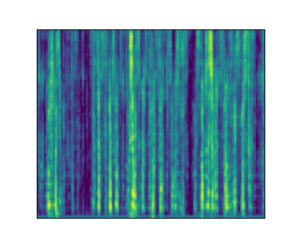
          <audio controls>
            <source src="assets/recon/mel/ses_0_cable_spool_fort_5_043.wav" type="audio/mp3">
            Your browser does not support the audio element.
          </audio>
        

      </td>
      <td>
        

          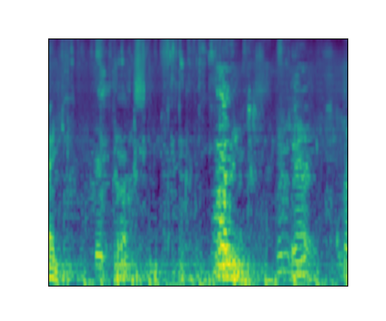
          <audio controls>
            <source src="assets/recon/wav2vec2/ses_0_cable_spool_fort_5_043.wav" type="audio/mp3">
            Your browser does not support the audio element.
          </audio>
        

      </td>
      <td>
        

          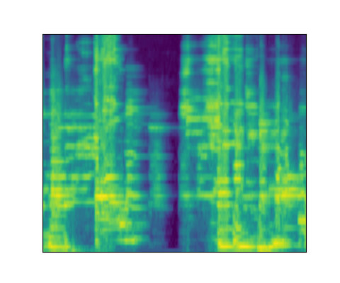
          <audio controls>
            <source src="assets/recon/audiomae/ses_0_cable_spool_fort_5_043.wav" type="audio/mp3">
            Your browser does not support the audio element.
          </audio>
        

      </td>
      <td>
        

          
          <audio controls>
            <source src="assets/recon/encodec/ses_0_cable_spool_fort_5_043.wav" type="audio/mp3">
            Your browser does not support the audio element.
          </audio>
        

      </td>
    </tr>
  </tbody>
</table>

---

    <table class="gallery-table">
      <thead>
        <tr>
          <th style="width: 50%;">Stimulus</th>
          <th style="width: 50%;">Ours</th>
        </tr>
      </thead>
      <tbody>
        <tr>
          <td>
            

              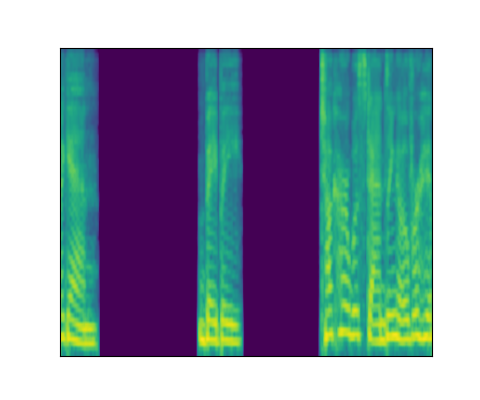
              <audio controls>
                <source src="assets/recon/gt/ses_0_cable_spool_fort_3_049.wav" type="audio/mp3">
                Your browser does not support the audio element.
              </audio>
            

          </td>
          <td>
            

              
              <audio controls>
                <source src="assets/recon/ours/ses_1_cable_spool_fort_3_049.wav" type="audio/mp3">
                Your browser does not support the audio element.
              </audio>
            

          </td>
        </tr>
      </tbody>
    </table>

<table class="gallery-table">
  <thead>
    <tr>
      <th>Mel</th>
      <th>Wav2vec2</th>
      <th>AudioMAE</th>
      <th>EnCodec</th>
    </tr>
  </thead>
  <tbody>
    <tr>
      <td>
        

          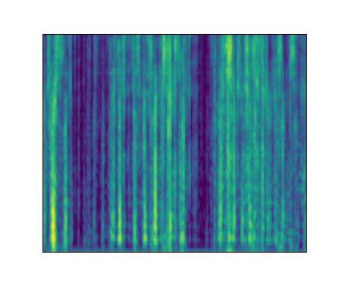
          <audio controls>
            <source src="assets/recon/mel/ses_1_cable_spool_fort_3_049.wav" type="audio/mp3">
            Your browser does not support the audio element.
          </audio>
        

      </td>
      <td>
        

          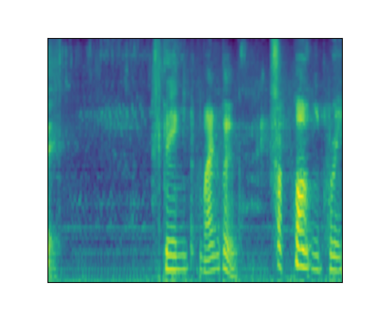
          <audio controls>
            <source src="assets/recon/wav2vec2/ses_1_cable_spool_fort_3_049.wav" type="audio/mp3">
            Your browser does not support the audio element.
          </audio>
        

      </td>
      <td>
        

          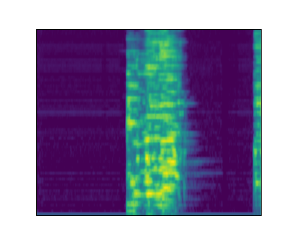
          <audio controls>
            <source src="assets/recon/audiomae/ses_1_cable_spool_fort_3_049.wav" type="audio/mp3">
            Your browser does not support the audio element.
          </audio>
        

      </td>
      <td>
        

          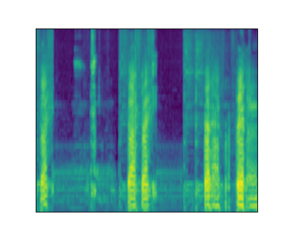
          <audio controls>
            <source src="assets/recon/encodec/ses_1_cable_spool_fort_3_049.wav" type="audio/mp3">
            Your browser does not support the audio element.
          </audio>
        

      </td>
    </tr>
  </tbody>
</table>